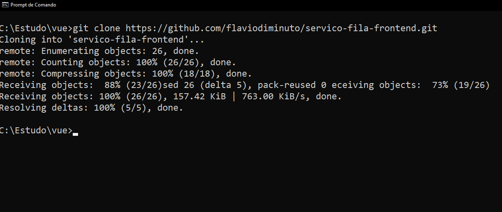
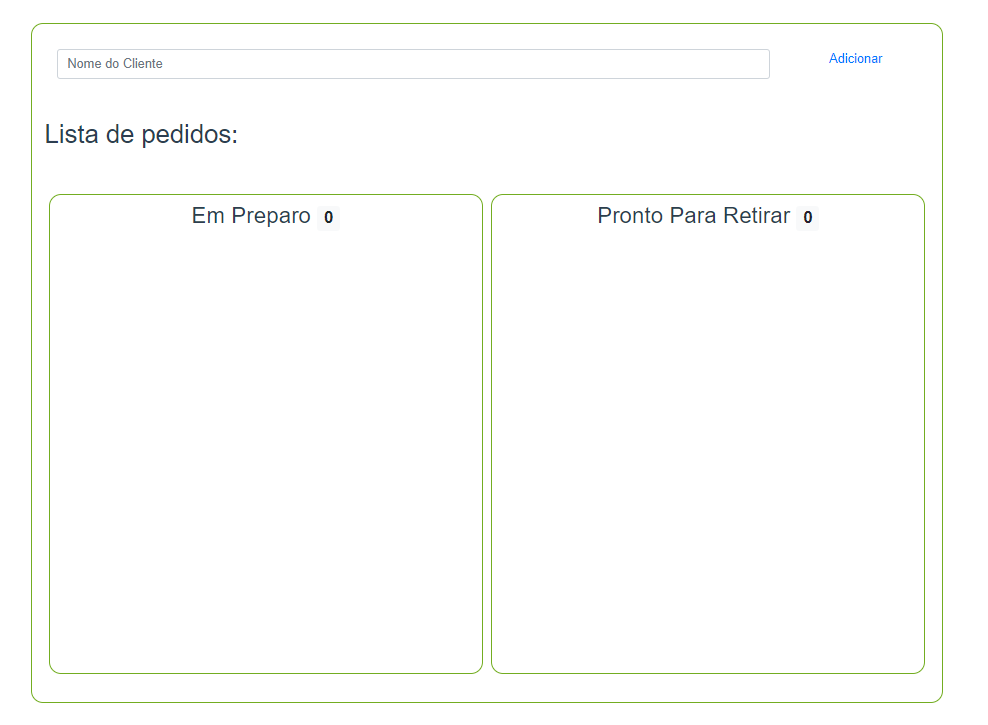

# servico-fila-frontend Project

Este projeto utiliza VueJs,
se quiser conhecer mais sobre VueJs basta visitar o site oficial https://vuejs.org/

> **_NOTA:_** Antes de executar este projeto sertifique-se de executar o projeto backend antes
> 
> https://github.com/flaviodiminuto/servico-fila-backend

## Requisitos para executar o projeto
- Prompt de comando (Terminal)
- [Node js](https://nodejs.org/en/)
- [VueJs](https://vuejs.org/guide/quick-start.html#with-build-tools)
- [Axios](https://www.npmjs.com/package/axios)
- [BootstrapVue](https://www.npmjs.com/package/bootstrap-vue)

## Clonando o projeto em seu computador

Para ter o projeto execute o seguinte comando no terminal
```shell script
git clone https://github.com/flaviodiminuto/servico-fila-frontend.git
```


## Executando a aplicação
Navegue até a pasta raiz do projeto e execute o seguinte comando
```shell script
npm run serve
```

Abra seu navegador e acesse o endereço
http://localhost:8080

A tela da fila vazia deve aparecer
